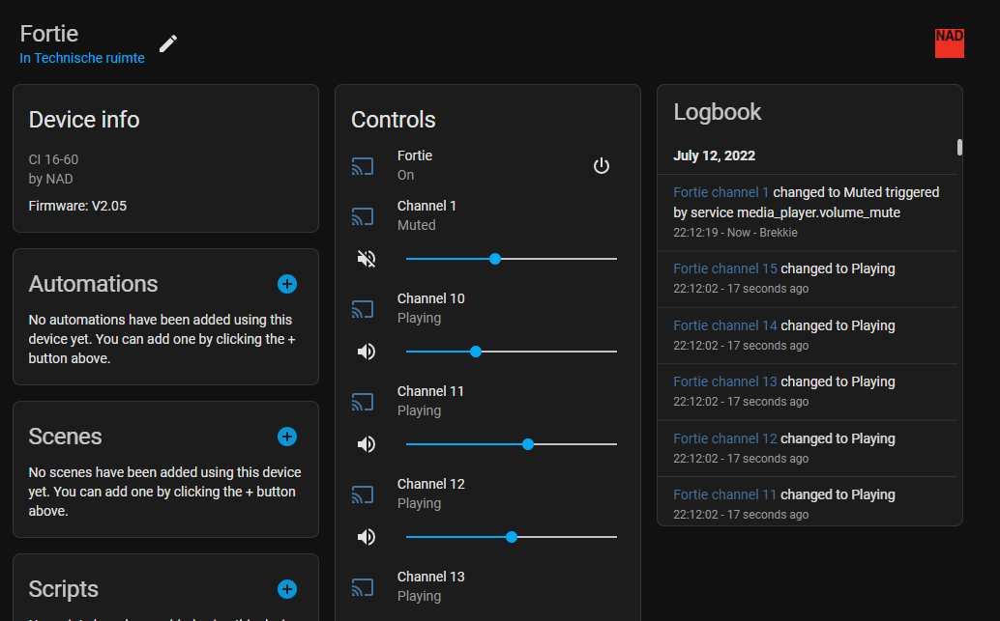
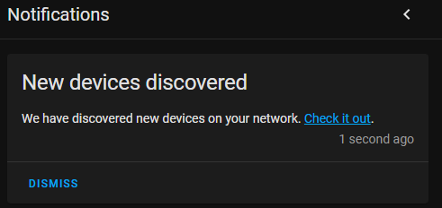
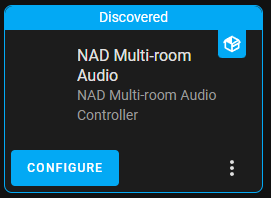
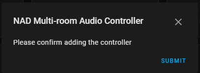
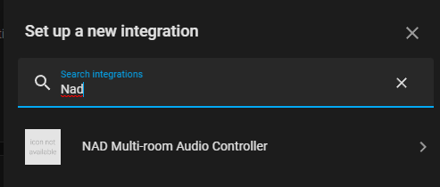
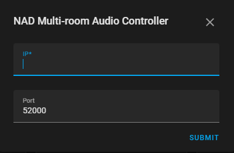

# NAD Multi-room Audio Controller Integration

This integration integrates with NAD multi-room audio amplifiers.
It provides control over output volume, output muting, input selection, DSP presets and power cycling.

## Overview

One entity will be created for the controller itself, and one for each channel.

_The entity is named after the `Unit Name`, as configured in NAD's web interface._
_In this case, that's 'Fortie'._

### Receiver entity

The receiver is only used to control the power. Available services:
* `media_player.turn_on`
* `media_player.turn_off`
* `media_player.toggle`

### Channel entities

One channel is created for every output. Available services:
* `media_player.volume_up`
* `media_player.volume_down`
* `media_player.volume_set`
* `media_player.volume_mute`
* `media_player.select_source`
* `media_player.select_sound_mode`

#### Sources

When calling `media_player.select_source`, the _Source_ must be one of:

* `Global1`
* `Global2`
* `Source1`
* `Source2`
* `Source3`
* `Source4`
* `Source5`
* `Source6`
* `Source7`
* `Source8`
* `Source9`
* `Source10`
* `Source11`
* `Source12`
* `Source13`
* `Source14`
* `Source15`
* `Source16`

> **Warning**
> 
> Selecting the global inputs will override the inputs of all channels.
> Manually selecting an input afterwards turns global mode off again and channels' source is set back to its original value.

#### Sound modes

When calling `media_player.select_sound_mode`, the _Sound mode_ must be one of:

* `PresentNone`
* `Preset1`
* `Preset2`
* `Preset3`
* `Preset4`
* `Preset5`
* `Preset6`
* `Preset7`
* `Preset8`
* `Preset9`

## Compatible devices

* NAD Cl 16-60

## Setup

> **Note**
> 
> This integration requires [HACS](https://github.com/hacs/integration) to be installed

1. Open HACS
2. Open the options in the top right and select _Custom repositories_
3. Enter this repository's URL (`https://github.com/Breina/nad_controller`) under the Category _Integration_.
4. Press _Add_
5. _+ EXPLORE & DOWNLOAD REPOSITORIES_
6. Find _NAD Multi-room Audio Controller_ in this list
7. _DOWNLOAD THIS REPOSITORY WITH HACS_
8. _DOWNLOAD_
9. Restart Home Assistant (_Settings_ > _System_ >  _RESTART_)

The flow can now proceed in one of two ways:

### Automatic flow

 1. Through UPNP, the controller can be discovered automatically.

 2. Either click the _Check it out_ link or navigate to _Settings_ > _Devices & Services_ to find the discovery.

> **Note**
> 
> If this does not show up, please proceed with the _Manual installation_ flow

 3. After pressing _CONFIGURE_, a final confirmation is prompted.

 4. When _SUBMIT_ is pressed, success dialog should be shown.

 5. After optionally setting its area and confirming with _FINISH_, the integration is now active and ready to be used.

### Manual flow

 1. Navigate to the integrations page: _Settings_ > _Devices & Services_
 2. _+ ADD INTEGRATION_
 3. Select _NAD Multi-room Audio Controller_ in this selection window

 4. Enter the IP and Port (52000 by default) and press _SUBMIT_

 5. After optionally setting its area and confirming with _FINISH_, the integration is now active and ready to be used.

